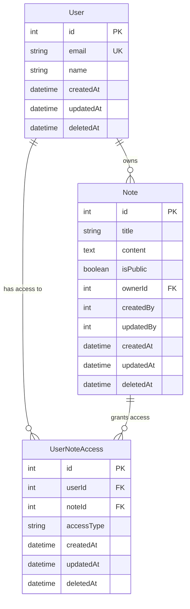
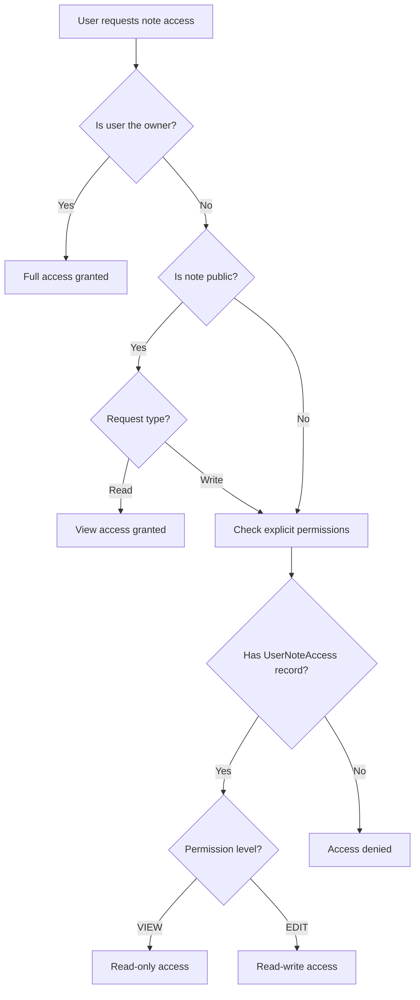

# ADR-001: Database Schema Design and Relationships

## Status
Accepted

## Context
We need to design a database schema for a notes management system that supports user management, note creation, sharing, and fine-grained access control. The system requires both ownership-based and permission-based access patterns.

## Decision
We have chosen a relational database design using PostgreSQL with Prisma ORM, implementing a multi-table approach with clear separation of concerns:

1. **User table** - Core user management
2. **Note table** - Note storage with ownership
3. **UserNoteAccess table** - Junction table for fine-grained permissions
4. **AccessType enum** - Standardized permission levels

### Database Schema

### Access Control Flow

## Rationale

### Advantages
1. **Clear separation of ownership vs. permissions** - Notes have clear owners while supporting shared access
2. **Flexible permission system** - Junction table allows many-to-many relationships with typed permissions
3. **Public/private support** - Boolean flag for unrestricted public access
4. **Audit trail** - All tables include creation, modification, and deletion timestamps
5. **Scalable design** - Can easily add new permission types or sharing features

### Schema Design Principles
1. **Normalized structure** - Eliminates data duplication and maintains consistency
2. **Soft delete pattern** - Enables data recovery and audit trails
3. **Constraint enforcement** - Database-level constraints ensure data integrity
4. **Index optimization** - Foreign keys and unique constraints support efficient queries

## Alternatives Considered

### Option 1: Single Permission Column on Notes
- Store permissions as JSON/array column on notes table
- **Rejected**: Poor query performance, no referential integrity, difficult to maintain

### Option 2: Role-Based Access Control (RBAC)
- Implement system-wide roles with note assignments
- **Rejected**: Over-engineered for current requirements, less flexible for note-specific permissions

### Option 3: Document Database (MongoDB)
- Use embedded documents for permissions
- **Rejected**: Relational access patterns better suited for SQL, team expertise with PostgreSQL

## Consequences

### Positive
- ✅ Clear data model that maps directly to business requirements
- ✅ Efficient querying with proper indexing on foreign keys
- ✅ Type-safe operations through Prisma ORM
- ✅ Easy to extend with additional permission types
- ✅ Supports both individual and public sharing models

### Negative
- ❌ Requires joins for permission checks (mitigated by proper indexing)
- ❌ More complex than simple owner-only model
- ❌ Additional table maintenance for UserNoteAccess records

### Migration Considerations
- Database migrations handled through Prisma
- Existing data can be migrated by setting all notes to private initially
- UserNoteAccess records can be populated based on sharing requirements

## Implementation Notes
- All models include soft delete timestamps (`deletedAt`)
- Email uniqueness enforced only on active (non-deleted) users
- Cascade deletion handled at application level for audit purposes
- Foreign key constraints ensure referential integrity