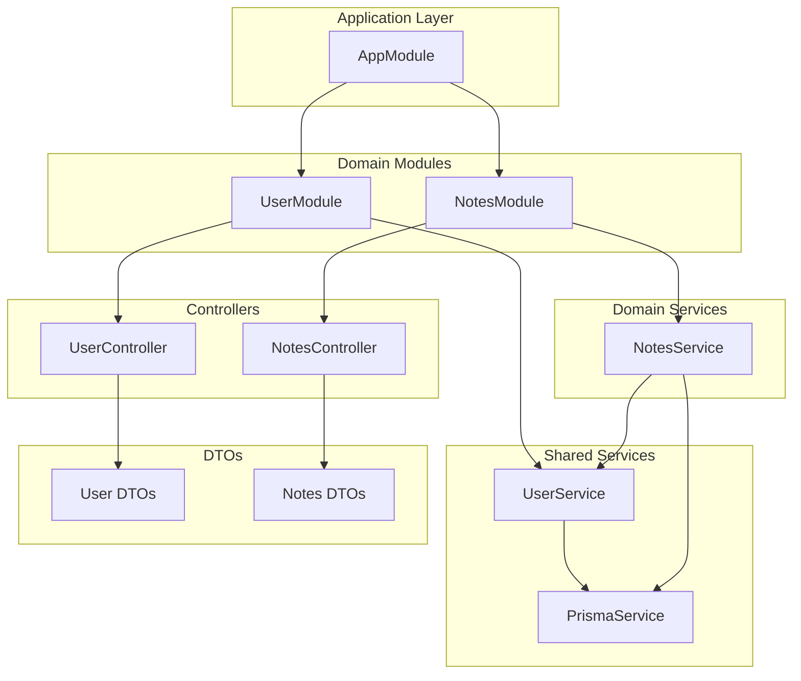
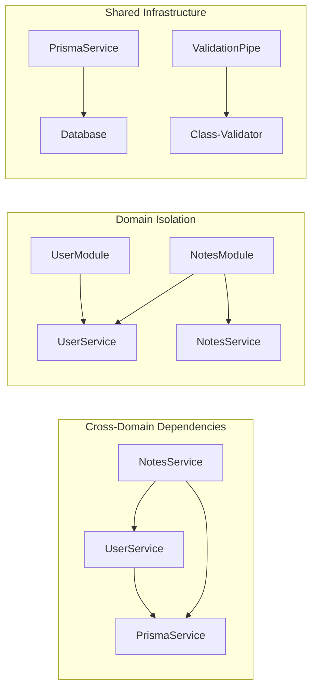
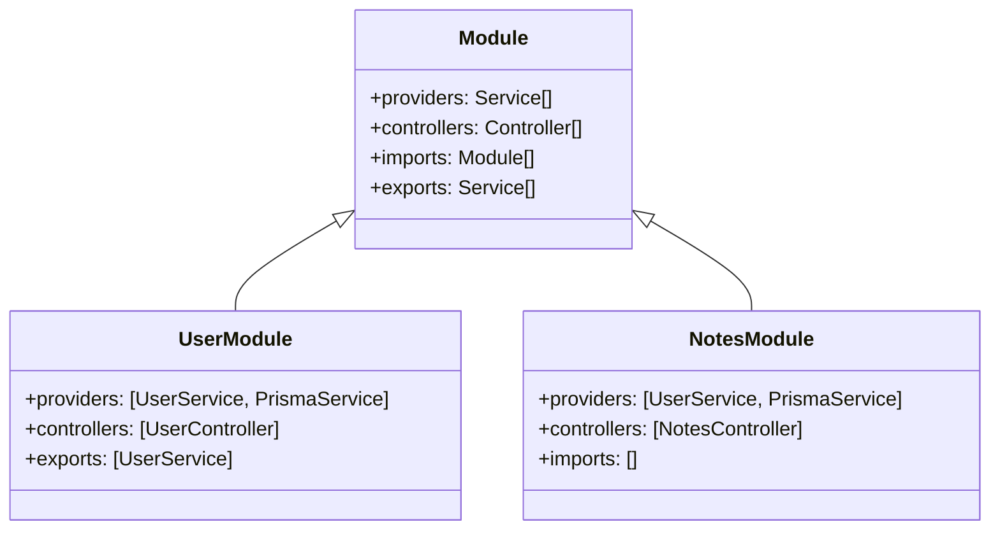
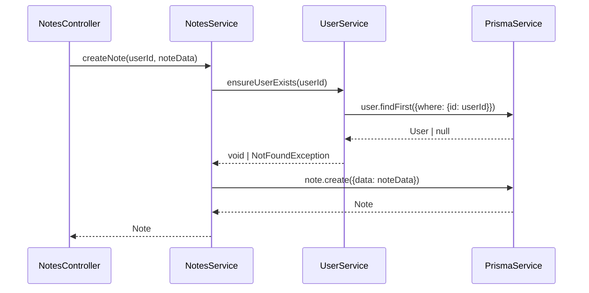
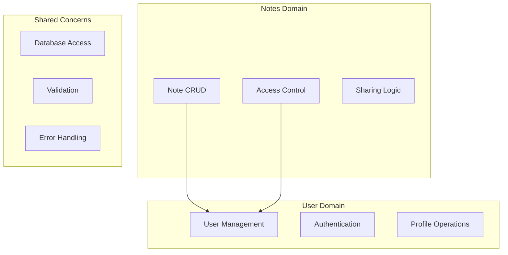
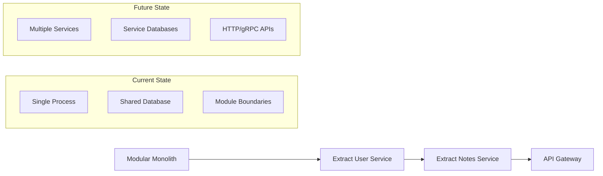

# ADR-004: Module Architecture and Service Dependencies

## Status
Accepted

## Context
The notes management API requires a scalable, maintainable architecture that supports multiple domains (users, notes) while maintaining clear separation of concerns. The system must handle cross-domain dependencies efficiently while following NestJS best practices and SOLID principles.

## Decision
We have implemented a **modular monolith architecture** using NestJS modules with clear domain boundaries, shared services, and explicit dependency management through dependency injection.

### Module Architecture Overview



### Service Dependency Architecture



### Module Structure Pattern



## Rationale

### Design Principles
1. **Domain-Driven Design** - Modules aligned with business domains
2. **Single Responsibility** - Each module handles one domain
3. **Dependency Inversion** - Services depend on abstractions (DI)
4. **Open/Closed Principle** - Easy to extend without modification
5. **Explicit Dependencies** - Clear service relationships

### Module Organization Strategy
- **Feature-based modules** rather than layer-based
- **Shared services** imported where needed
- **Clear API boundaries** through controllers
- **Domain isolation** with explicit inter-module communication

### Cross-Module Communication Pattern



## Implementation Details

### Module Structure
```
src/
├── app.module.ts          # Root module
├── user/
│   ├── user.module.ts     # User domain module
│   ├── user.controller.ts # HTTP endpoints
│   ├── user.service.ts    # Business logic
│   └── dto/              # Data transfer objects
└── notes/
    ├── notes.module.ts    # Notes domain module
    ├── notes.controller.ts
    ├── notes.service.ts
    └── dto/
```

### Service Dependency Configuration
```typescript
// NotesModule configuration
@Module({
  providers: [UserService, PrismaService], // Import required services
  controllers: [NotesController],
})
export class NotesModule {}

// NotesService dependencies
@Injectable()
export class NotesService {
  constructor(
    private prisma: PrismaService,      // Database access
    private userService: UserService,   // Cross-domain validation
  ) {}
}
```

### Shared Service Pattern
```typescript
// UserService methods used across modules
export class UserService {
  // Public method for cross-module validation
  async ensureUserExists(id: number, includeDeleted = false): Promise<void> {
    // Implementation
  }
  
  // Private methods for internal use only
  private async validateEmailUniqueness(email: string): Promise<void> {
    // Implementation
  }
}
```

## Alternatives Considered

### Option 1: Layered Architecture
- Organize by technical layers (controllers/, services/, repositories/)
- **Rejected**: Poor cohesion, changes require modifications across layers

### Option 2: Microservices
- Separate applications for users and notes
- **Rejected**: Over-engineered for current scale, increased complexity

### Option 3: Single Module Monolith
- All functionality in one module
- **Rejected**: Poor maintainability, violates separation of concerns

### Option 4: Shared Database Module
- Separate module for all database operations
- **Rejected**: Creates tight coupling, reduces domain autonomy

## Architectural Benefits

### Domain Boundaries


### Service Responsibility Matrix
| Service | Primary Responsibility | Dependencies | Exports |
|---------|----------------------|--------------|---------|
| UserService | User lifecycle management | PrismaService | User validation methods |
| NotesService | Notes business logic | UserService, PrismaService | - |
| PrismaService | Database abstraction | Database connection | Query methods |

## Consequences

### Positive
- ✅ **Clear domain boundaries** - Easy to understand and maintain
- ✅ **Loose coupling** - Modules can evolve independently
- ✅ **Testability** - Easy to mock dependencies in unit tests
- ✅ **Scalability** - New domains can be added without affecting existing code
- ✅ **Code reuse** - Shared services prevent duplication

### Negative
- ❌ **Cross-module dependencies** - NotesService depends on UserService
- ❌ **Module loading complexity** - Must ensure proper provider registration
- ❌ **Potential circular dependencies** - Requires careful design

### Performance Implications
- Service instantiation handled by NestJS DI container
- Singleton pattern for shared services
- Minimal overhead from module boundaries
- Efficient dependency resolution at startup

### Maintenance Considerations
- Clear dependency graph makes impact analysis easier
- Module boundaries provide natural testing seams
- Refactoring contained within domain boundaries
- New features typically require single module changes

## Future Evolution Strategy

### Microservices Migration Path


### Extension Points
1. **New Domain Modules** - Authentication, File Management, etc.
2. **Shared Libraries** - Common DTOs, utilities
3. **Event-Driven Communication** - Replace direct service calls
4. **Database per Module** - Separate schemas for true isolation

## Testing Strategy
- **Unit Tests** - Mock dependencies for isolated testing
- **Integration Tests** - Test module interactions
- **E2E Tests** - Full application flow testing
- **Contract Tests** - Verify service interfaces remain stable