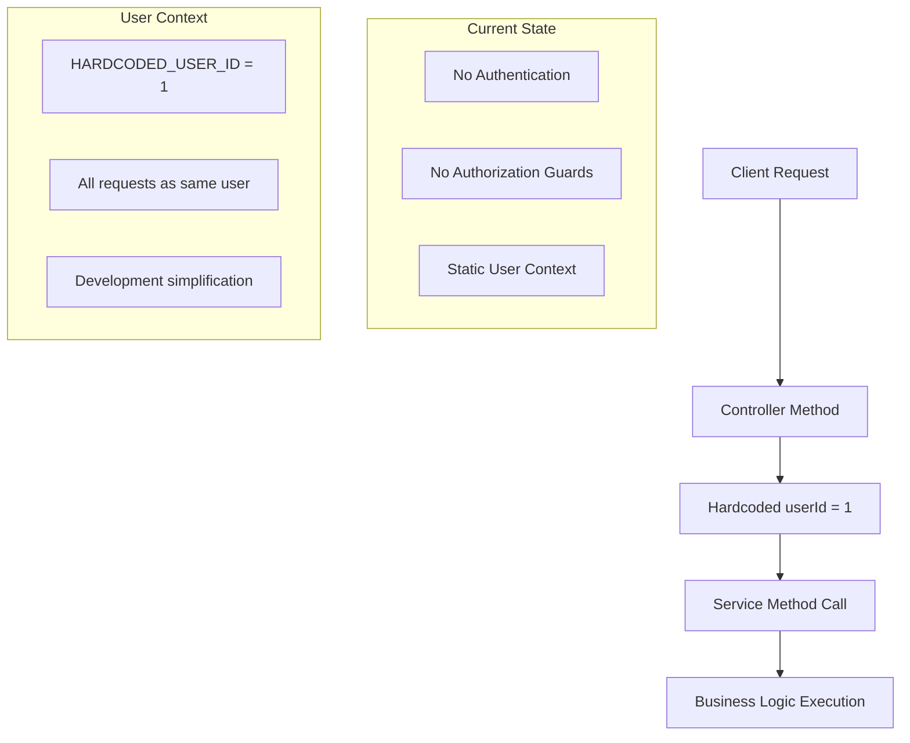
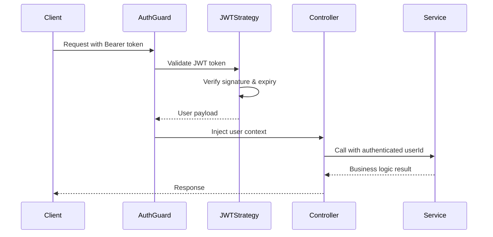
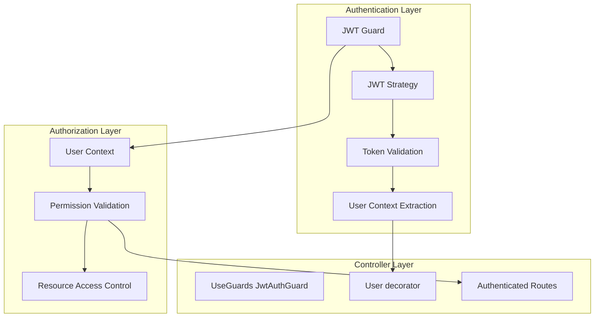
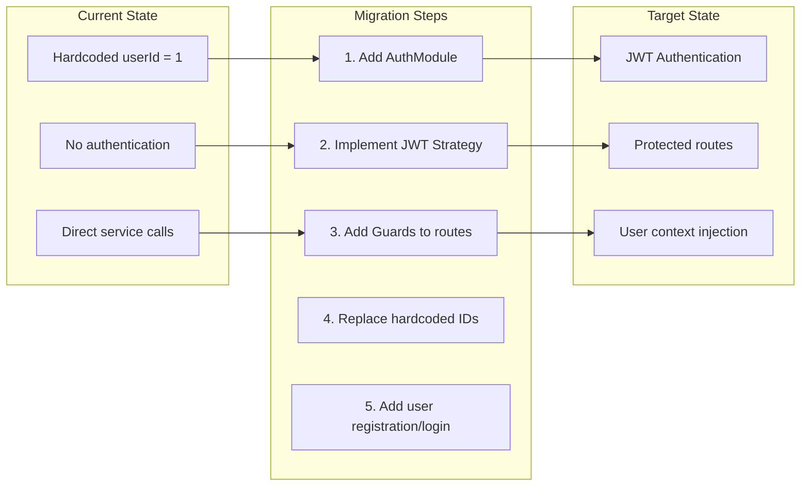

# ADR-005: Authentication Strategy and Current Implementation

## Status
Accepted (Temporary Implementation)

## Context
The notes management API requires user authentication to enforce access control and permission systems. However, the initial development phase needs to focus on core business logic without the complexity of a full authentication system. A strategy is needed that allows development to proceed while planning for proper authentication implementation.

## Decision
We have implemented a **two-phase authentication strategy**:
1. **Phase 1 (Current)**: Hardcoded user ID for development
2. **Phase 2 (Future)**: JWT-based authentication with NestJS guards

### Current Implementation Architecture



### Future Authentication Flow



### Planned Authentication Architecture



## Rationale

### Current Implementation Justification
1. **Development Velocity** - Focus on business logic without auth complexity
2. **API Testing** - Easy to test endpoints without token management
3. **Core Feature Development** - Build permission system with known user context
4. **Iterative Development** - Add auth layer when core features are stable

### Future Implementation Plan
1. **JWT-based authentication** for stateless operation
2. **NestJS Guards** for route protection
3. **Passport.js integration** for authentication strategies
4. **User decorator** for clean user context injection

## Current Implementation Details

### Controller Pattern
```typescript
@Controller('notes')
export class NotesController {
  private readonly HARDCODED_USER_ID = 1; // TODO: Replace with auth guard
  
  @Post()
  async createNote(@Body() noteData: CreateNoteDto): Promise<Note> {
    return this.notesService.createEmptyNote(this.HARDCODED_USER_ID, noteData);
  }
  
  @Get(':id')
  async getNoteById(@Param('id', ParseIntPipe) id: number): Promise<NoteDetails> {
    return this.notesService.findNoteById(id, this.HARDCODED_USER_ID);
  }
}
```

### Service Layer Preparation
```typescript
// Services already accept userId parameter - ready for auth
export class NotesService {
  async createEmptyNote(userId: number, noteData: CreateNoteDto): Promise<Note> {
    await this.userService.ensureUserExists(userId); // Validates user exists
    // ... business logic
  }
}
```

## Future Implementation Design

### Authentication Module Structure
```typescript
@Module({
  imports: [
    PassportModule,
    JwtModule.registerAsync({
      useFactory: (configService: ConfigService) => ({
        secret: configService.get('JWT_SECRET'),
        signOptions: { expiresIn: '24h' },
      }),
      inject: [ConfigService],
    }),
  ],
  providers: [AuthService, JwtStrategy],
  controllers: [AuthController],
  exports: [AuthService],
})
export class AuthModule {}
```

### JWT Strategy Implementation
```typescript
@Injectable()
export class JwtStrategy extends PassportStrategy(Strategy) {
  constructor(private userService: UserService) {
    super({
      jwtFromRequest: ExtractJwt.fromAuthHeaderAsBearerToken(),
      ignoreExpiration: false,
      secretOrKey: process.env.JWT_SECRET,
    });
  }

  async validate(payload: JwtPayload): Promise<User> {
    return this.userService.findUserById(payload.sub);
  }
}
```

### Protected Route Pattern
```typescript
@Controller('notes')
@UseGuards(JwtAuthGuard)
export class NotesController {
  @Post()
  async createNote(
    @Body() noteData: CreateNoteDto,
    @User() user: User, // Injected by auth guard
  ): Promise<Note> {
    return this.notesService.createEmptyNote(user.id, noteData);
  }
}
```

## Migration Strategy

### Phase 1 → Phase 2 Transition



### Migration Checklist
- [ ] **Environment Configuration** - Add JWT_SECRET to environment variables
- [ ] **AuthModule Implementation** - Create authentication module with JWT strategy
- [ ] **User Registration/Login** - Add endpoints for user account management
- [ ] **Route Protection** - Add guards to all protected endpoints
- [ ] **Controller Updates** - Replace hardcoded IDs with user context injection
- [ ] **Error Handling** - Add authentication-specific error responses
- [ ] **Testing Updates** - Update tests to handle authentication context

## Alternatives Considered

### Option 1: Session-Based Authentication
- Server-side session storage with cookies
- **Rejected**: Not suitable for API-first architecture, scaling concerns

### Option 2: API Key Authentication
- Simple API keys for service authentication
- **Rejected**: Less secure, poor user experience for web clients

### Option 3: OAuth 2.0 / OpenID Connect
- Third-party authentication providers (Google, GitHub, etc.)
- **Deferred**: Good for future enhancement, but adds complexity for MVP

### Option 4: Basic Authentication
- Username/password in headers for each request
- **Rejected**: Poor security (credentials in every request), no session management

## Consequences

### Current Phase Benefits
- ✅ **Rapid development** - No authentication overhead during feature development
- ✅ **Simple testing** - Easy to test APIs without token management
- ✅ **Clear separation** - Authentication concerns separated from business logic
- ✅ **Consistent pattern** - All services expect userId parameter

### Current Phase Limitations
- ❌ **Security risk** - No real authentication in current state
- ❌ **Multi-user testing** - Cannot test with different user contexts
- ❌ **Production readiness** - Requires authentication before deployment

### Future Implementation Benefits
- ✅ **Industry standard** - JWT widely supported and understood
- ✅ **Stateless operation** - No server-side session storage required
- ✅ **Mobile-friendly** - Token-based auth works well with mobile apps
- ✅ **Microservices ready** - JWT tokens can be validated independently

### Security Considerations
- JWT secret must be properly secured
- Token expiration and refresh strategy needed
- Rate limiting on authentication endpoints
- Secure password hashing (bcrypt) for stored credentials
- HTTPS required for production deployment

## Implementation Timeline

### Immediate (Phase 1)
- ✅ Hardcoded user ID implementation complete
- ✅ Service layer ready for user context injection
- ✅ Permission system validates user existence

### Short Term (Phase 2)
- [ ] Add environment configuration for JWT
- [ ] Implement AuthModule with JWT strategy
- [ ] Create user registration/login endpoints
- [ ] Add authentication guards to routes

### Medium Term (Enhancements)
- [ ] Password reset functionality
- [ ] Email verification
- [ ] Rate limiting and security headers
- [ ] Refresh token implementation

## Testing Strategy
- **Current**: Mock user ID in all tests
- **Future**: Test with valid/invalid JWT tokens
- **Security**: Test authentication bypass attempts
- **Integration**: Test full auth flow from login to protected resource access