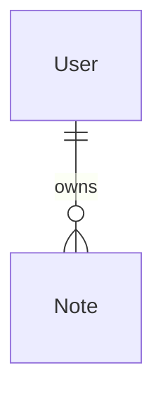
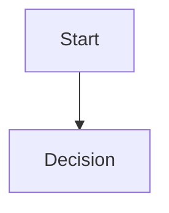
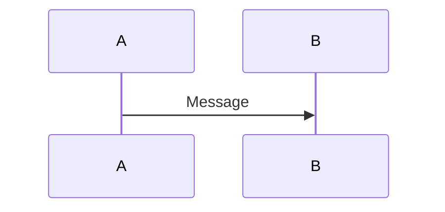
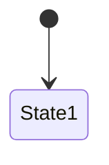
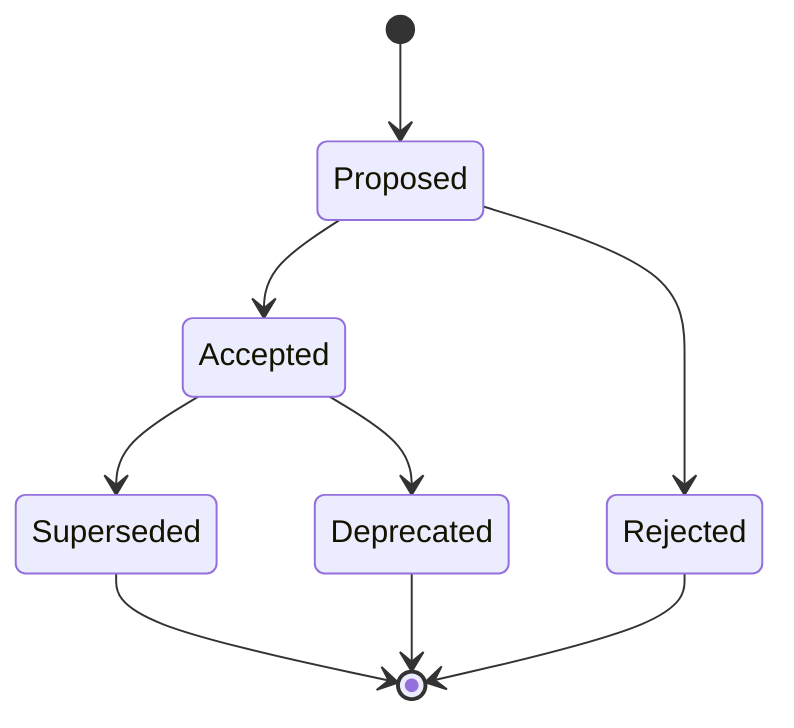

# Architecture Decision Records (ADRs)

This directory contains Architecture Decision Records for the Notes Management API. ADRs document important architectural decisions, their context, and consequences.

## ADR Index

| ADR | Title | Status | Date |
|-----|-------|--------|------|
| [001](001-database-schema-design.md) | Database Schema Design and Relationships | Accepted | 2025-01-07 |
| [002](002-access-control-system.md) | Access Control System Architecture | Accepted | 2025-01-07 |
| [003](003-soft-delete-pattern.md) | Soft Delete Pattern Implementation | Accepted | 2025-01-07 |
| [004](004-module-architecture.md) | Module Architecture and Service Dependencies | Accepted | 2025-01-07 |
| [005](005-authentication-strategy.md) | Authentication Strategy and Current Implementation | Accepted (Temporary) | 2025-01-07 |

## ADR Template

When creating new ADRs, use this template:

```markdown
# ADR-XXX: [Title]

## Status
[Proposed | Accepted | Rejected | Superseded | Deprecated]

## Context
[What is the issue that we're seeing that is motivating this decision or change?]

## Decision
[What is the change that we're proposing and/or doing?]

## Rationale
[Why are we making this decision? What are the driving factors?]

## Alternatives Considered
[What other options did we consider? Why were they rejected?]

## Consequences
[What becomes easier or more difficult to do because of this change?]

### Positive
- [Benefits of this decision]

### Negative  
- [Costs or drawbacks of this decision]

## Implementation Notes
[Any specific implementation details or considerations]
```

## Mermaid Diagram Guidelines

Our ADRs use Mermaid diagrams to visualize architectural decisions. Common diagram types:

### Entity Relationship Diagrams


### Flowcharts


### Sequence Diagrams


### State Diagrams


## Decision Process

1. **Identify Decision Point** - Recognize when an architectural decision needs to be made
2. **Research Options** - Investigate alternatives and gather information
3. **Document ADR** - Create ADR with context, decision, and rationale
4. **Review Process** - Team review and discussion
5. **Accept/Reject** - Final decision and status update
6. **Implementation** - Execute the decision with implementation notes
7. **Review Impact** - Periodically review consequences and lessons learned

## ADR Status Lifecycle



## Related Documentation

- [CLAUDE.md](../../CLAUDE.md) - Development guidance for Claude Code
- [README.md](../../README.md) - Project setup and basic information
- [Prisma Schema](../../prisma/schema.prisma) - Database schema definition

## Contributing

When making significant architectural changes:

1. Create a new ADR documenting the decision
2. Include relevant Mermaid diagrams
3. Consider impact on existing ADRs
4. Update implementation accordingly
5. Review and update related documentation