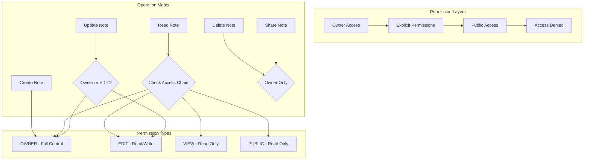
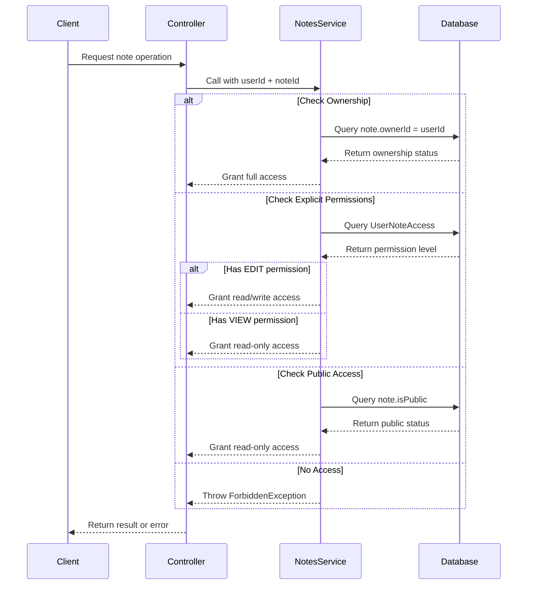
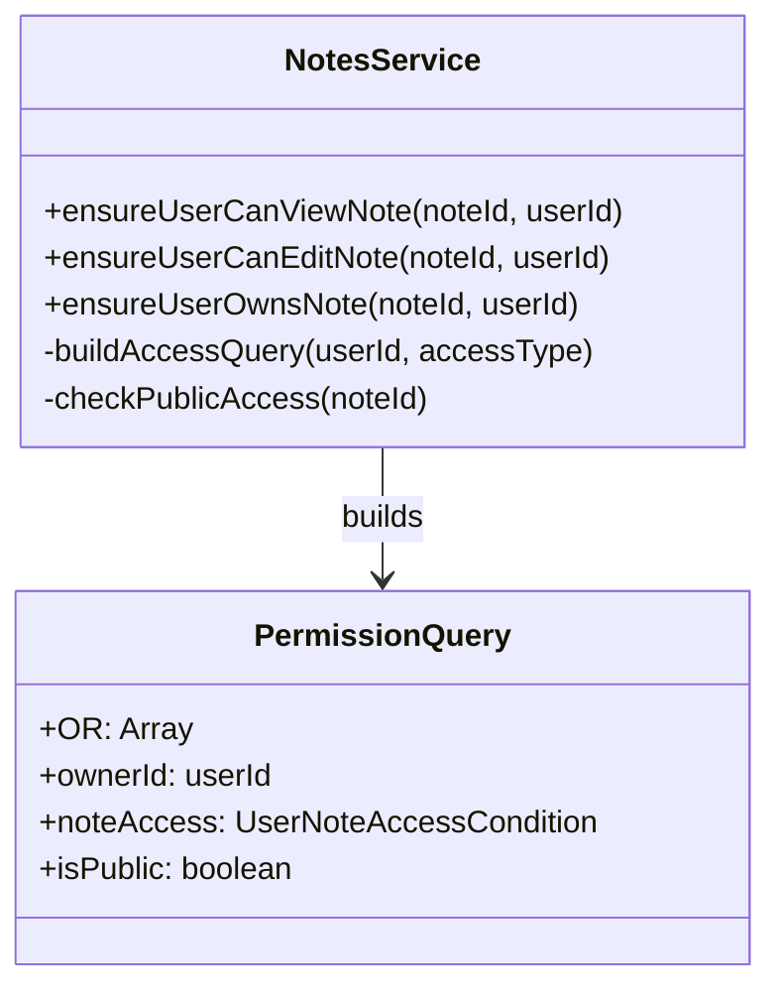

# ADR-002: Access Control System Architecture

## Status
Accepted

## Context
The notes management system requires a sophisticated access control mechanism that supports multiple access patterns:
- Ownership-based full control
- Granular user permissions (VIEW/EDIT)
- Public note access
- Permission inheritance and validation

The system must enforce these permissions consistently across all operations while maintaining performance and security.

## Decision
We have implemented a **multi-layered access control system** combining ownership, explicit permissions, and public access patterns with service-layer enforcement.

### Access Control Architecture



### Permission Validation Flow



### Service-Layer Permission Methods



## Rationale

### Design Principles
1. **Defense in Depth** - Multiple permission layers with fallback options
2. **Principle of Least Privilege** - Default deny with explicit grants
3. **Separation of Concerns** - Permission logic isolated in service layer
4. **Performance Optimization** - Single database queries with OR conditions
5. **Audit Trail** - All permission checks logged through service methods

### Permission Hierarchy
```
OWNER > EDIT > VIEW > PUBLIC > DENIED
```

### Access Patterns Supported
- **Individual Ownership** - Full control over owned notes
- **Collaborative Editing** - EDIT permission for shared modification
- **Read-Only Sharing** - VIEW permission for content access
- **Public Publishing** - isPublic flag for unrestricted access
- **Private Notes** - Default deny for unauthorized users

## Alternatives Considered

### Option 1: Attribute-Based Access Control (ABAC)
- Dynamic permission evaluation based on user/note attributes
- **Rejected**: Over-complex for current requirements, performance concerns

### Option 2: Simple Owner-Only Model
- Only note owners can access/modify notes
- **Rejected**: Doesn't support collaboration requirements

### Option 3: Role-Based Access Control (RBAC)
- System-wide roles (Admin, Editor, Viewer) with note assignments
- **Rejected**: Too rigid, doesn't support per-note permissions

### Option 4: ACL (Access Control Lists)
- Store permissions as arrays/JSON in note records
- **Rejected**: Poor query performance, no referential integrity

## Implementation Details

### Permission Check Methods

```typescript
// Ownership verification
private async ensureUserOwnsNote(noteId: number, userId: number): Promise<void>

// Edit permission (Owner OR explicit EDIT access)
private async ensureUserCanEditNote(noteId: number, userId: number): Promise<void>

// View permission (Owner OR EDIT OR VIEW OR public)
private async ensureUserCanViewNote(noteId: number, userId: number): Promise<void>
```

### Database Query Optimization

```sql
-- Single query for permission checking
SELECT * FROM notes 
WHERE id = ? AND (
  ownerId = ? OR                    -- Owner access
  id IN (                           -- Explicit permissions
    SELECT noteId FROM user_note_access 
    WHERE userId = ? AND accessType IN ('VIEW', 'EDIT')
  ) OR
  isPublic = true                   -- Public access
)
```

## Consequences

### Positive
- ✅ **Flexible sharing model** supports multiple collaboration patterns
- ✅ **Performance optimized** with single-query permission checks
- ✅ **Security enforced** at service layer with consistent validation
- ✅ **Audit friendly** with explicit permission tracking
- ✅ **Extensible design** easy to add new permission types

### Negative
- ❌ **Complexity overhead** requires understanding of permission hierarchy
- ❌ **Additional queries** for permission validation on every operation
- ❌ **Data consistency** requires careful management of UserNoteAccess records

### Security Considerations
- All permission checks performed server-side
- No client-side permission evaluation
- Consistent error messages to prevent information leakage
- Soft-deleted records excluded from permission queries

### Performance Implications
- Foreign key indexes on userId, noteId for fast lookups
- OR query optimization through proper indexing strategy
- Permission caching potential for future optimization

## Migration Strategy
1. Start with owner-only permissions for existing notes
2. Gradually add explicit permissions through sharing features
3. Public notes require explicit owner action
4. Maintain backward compatibility during permission system evolution