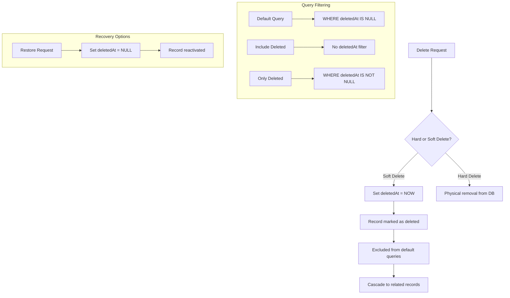
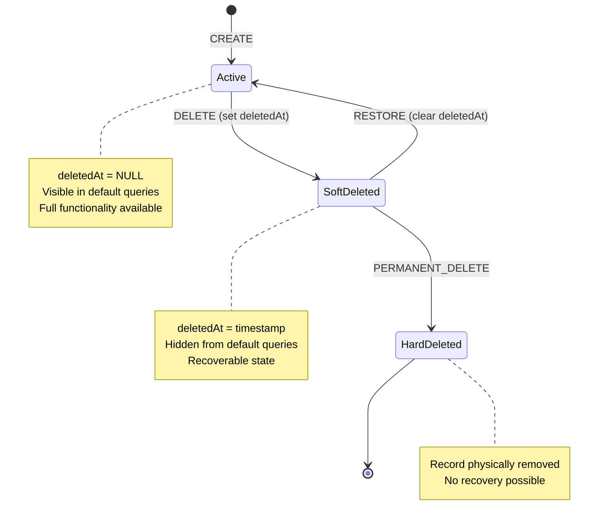
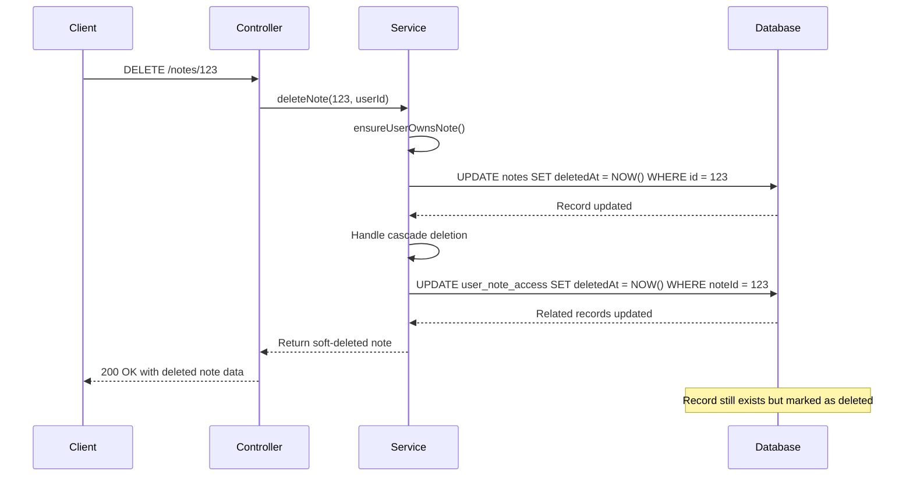
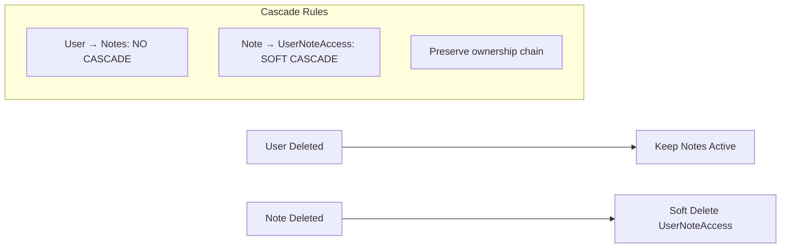
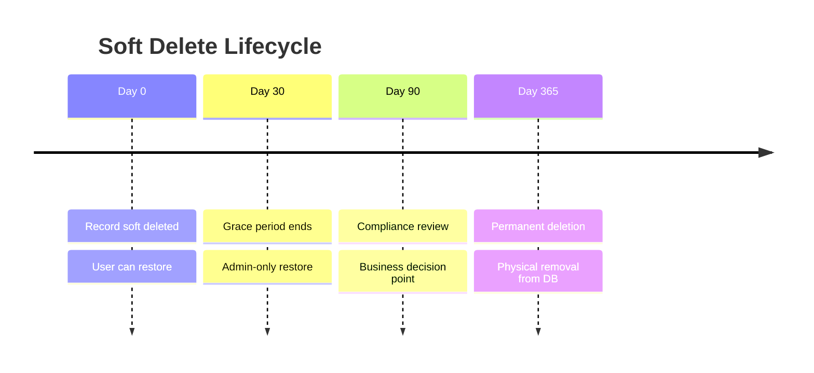

# ADR-003: Soft Delete Pattern Implementation

## Status
Accepted

## Context
The notes management system requires a deletion strategy that balances data integrity, user experience, and business requirements. Users need the ability to "delete" notes and users, but the system must maintain data for audit purposes, potential recovery, and referential integrity.

## Decision
We have implemented a **consistent soft delete pattern** across all entities using `deletedAt` timestamp fields, with application-level filtering and optional recovery functionality.

### Soft Delete Architecture



### Soft Delete State Machine



### Implementation Pattern



## Rationale

### Advantages of Soft Delete
1. **Data Recovery** - Users can restore accidentally deleted content
2. **Audit Trail** - Complete history of all operations maintained
3. **Referential Integrity** - Foreign key relationships preserved
4. **Business Intelligence** - Analytics on deleted vs. active content
5. **Compliance** - Meet data retention requirements
6. **Cascade Control** - Granular control over related record deletion

### Implementation Strategy
- **Consistent pattern** across all entities (User, Note, UserNoteAccess)
- **Default exclusion** from queries unless explicitly included
- **Service-layer enforcement** for deletion permissions
- **Optional recovery** through restore endpoints

## Implementation Details

### Database Schema Pattern
```sql
-- All tables include deletedAt column
ALTER TABLE users ADD COLUMN deletedAt TIMESTAMP NULL;
ALTER TABLE notes ADD COLUMN deletedAt TIMESTAMP NULL;
ALTER TABLE user_note_access ADD COLUMN deletedAt TIMESTAMP NULL;

-- Indexes for performance
CREATE INDEX idx_users_deleted_at ON users(deletedAt);
CREATE INDEX idx_notes_deleted_at ON notes(deletedAt);
CREATE INDEX idx_user_note_access_deleted_at ON user_note_access(deletedAt);
```

### Service Layer Pattern
```typescript
// Default query excludes deleted records
async findManyUsers(query: GetUsersQueryDto, includeDeleted = false): Promise<User[]> {
  const whereClause = {
    ...(includeDeleted ? {} : { deletedAt: null })
  };
  return this.prisma.user.findMany({ where: whereClause });
}

// Soft delete implementation
async deleteUser(id: number): Promise<User> {
  return this.prisma.user.update({
    where: { id },
    data: { deletedAt: new Date() }
  });
}

// Recovery implementation
async restoreUser(id: number): Promise<User> {
  return this.prisma.user.update({
    where: { id },
    data: { deletedAt: null }
  });
}
```

### Cascade Deletion Strategy



## Alternatives Considered

### Option 1: Hard Delete Only
- Immediate physical removal from database
- **Rejected**: No recovery possible, breaks audit trail, referential integrity issues

### Option 2: Archive Tables
- Move deleted records to separate archive tables
- **Rejected**: Complex query logic, duplicate schema maintenance

### Option 3: Status Field Enum
- Use status field with values (ACTIVE, DELETED, ARCHIVED)
- **Rejected**: Less intuitive than timestamp, no deletion time tracking

### Option 4: Event Sourcing
- Store all changes as events, derive current state
- **Rejected**: Over-engineered for current requirements, steep learning curve

## Consequences

### Positive
- ✅ **Data safety** - Accidental deletions can be recovered
- ✅ **Audit compliance** - Complete operation history maintained
- ✅ **User experience** - "Undo delete" functionality possible
- ✅ **Business analytics** - Analysis of deletion patterns and user behavior
- ✅ **Referential integrity** - Foreign key relationships preserved

### Negative
- ❌ **Storage overhead** - Deleted records consume database space
- ❌ **Query complexity** - Must remember to filter deleted records
- ❌ **Index overhead** - Additional indexes required for performance
- ❌ **Uniqueness constraints** - Email uniqueness must exclude deleted users

### Performance Considerations
- Indexes on `deletedAt` columns for efficient filtering
- Regular cleanup jobs for permanently removing old soft-deleted records
- Query optimization to ensure `WHERE deletedAt IS NULL` uses indexes
- Monitoring of storage growth from soft-deleted records

### Security Implications
- Deleted records still contain sensitive data
- Must consider soft-deleted data in privacy compliance (GDPR)
- Access control still applies to soft-deleted records
- Permanent deletion required for true data removal

## Migration and Cleanup Strategy

### Data Cleanup Policy


### Implementation Phases
1. **Phase 1**: Add `deletedAt` columns to existing tables
2. **Phase 2**: Update application code to filter deleted records
3. **Phase 3**: Implement restore functionality for users
4. **Phase 4**: Add permanent deletion for compliance
5. **Phase 5**: Implement automated cleanup policies

## Monitoring and Maintenance
- Track soft-deleted record counts by entity type
- Monitor storage impact of soft-deleted records
- Alert on unusual deletion patterns
- Regular cleanup of expired soft-deleted records
- Performance monitoring of queries with deletion filters